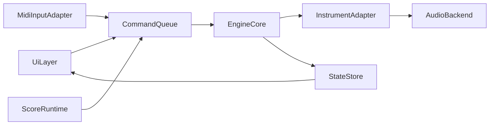

# 新版本目标架构

## 分层原则
- UI 层不直接操作音频 API。
- 核心领域层不依赖具体 GUI/驱动库。
- 音频线程与 UI 线程隔离，通过命令队列通信。

## 模块划分
- `app_ui`
  - 键盘可视化、参数面板、曲目控制。
- `input_adapter`
  - 键盘输入与（预留）MIDI 输入归一化。
- `engine_core`
  - 音符状态、移调、力度、播放状态机、调度逻辑。
- `score_runtime`
  - `*.in` / `*.keyboard` 解析与事件流生成。
- `audio_backend`
  - `wasapi_backend`（主）+ `dsound_backend`（回退）。
- `instrument_adapter`
  - `vsti_adapter` + `midi_out_adapter`。
- `platform_services`
  - 文件系统、日志、时间源、配置存储。

## 线程模型
- UI 线程：
  - 渲染、用户输入、配置变更、状态展示。
- 音频线程（高优先级）：
  - 固定缓冲周期拉取音频，处理实时 MIDI/控制命令。
- 回放线程（或高精定时器）：
  - 负责谱面时钟推进并投递事件，不阻塞 UI。

## 数据流

## 兼容策略
- 完整兼容旧版 `*.keyboard` 语义。
- 完整兼容旧版 `*.in` 的核心 token（`0`、`1..7`、`#`、`+/-`、`A..G`、`a..g`、`S`）。
- 提供兼容模式开关：
  - `legacy_timing_mode`（旧时序行为）
  - `strict_parser_mode`（严格输入校验）

## 性能与稳定性约束
- 回调路径禁用动态分配和阻塞 I/O。
- 命令队列使用无锁或最小锁开销结构。
- 参数更新采用原子/双缓冲，避免线程争用。
- 关键指标（首版建议）：
  - 48kHz 下稳定无爆音；
  - 按键到发声延迟体感可接受；
  - 长时播放无明显累计漂移。
